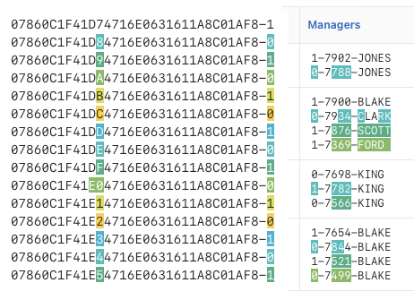

# APEX String Compare Template Component



Compare multiple strings with each other and highlight the differences.

Features

- Usable as multiple and partial
- Rotating Colors
- Compare to previous or first line
- Split strings by character

## Development based on Web Component

requirements: node.js

```bash
clone this repo

npm install
npm start -> development
npm build -> create bundles
```

Edit src/index.js and index.html for development
